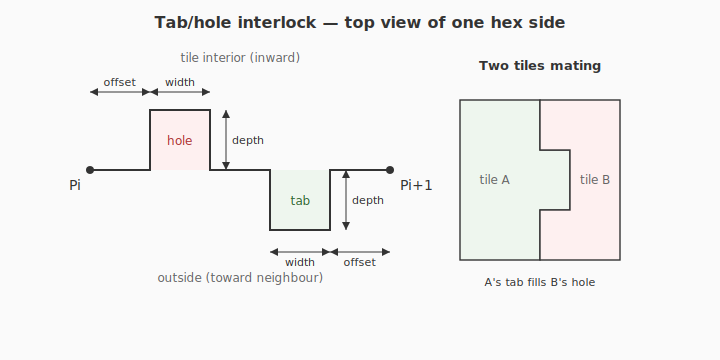
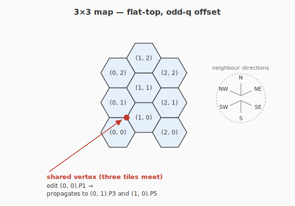

# HexFinity

A Blender 5.1 add-on for generating modular hexagonal terrain maps for tabletop miniatures and dioramas.

HexFinity generates an **X×Y map** of flat-top hexagonal tiles in one click. Each tile keeps an independently controllable level for each of its six corners, and corners that geometrically meet on the seam between tiles stay locked together so the map's surface is continuous across every join. The top surface of each tile is subdivided enough to support smooth transitions across the whole tile, and the resulting mesh of each tile is watertight (2-manifold) so it is ready for 3D printing, sculpting, or further modifier stacks.

All linear inputs are expressed in **millimeters**, and mesh vertices are emitted in millimeters too. Blender's STL exporter writes raw vertex values, so the exported `.stl` opens at true mm scale in any CAD program or slicer. In Blender's own viewport the tile appears at the numeric value — a 100 mm tile is 100 *units* wide — because Blender's default scene unit is metres; optionally switch the scene to *Metric · Millimeters* (`scale = 0.001`) for a friendlier on-screen display.

---

## Geometry

### Anatomy


*Top view* labels the six corners `P1`–`P6`, the six rim edges `E1`–`E6` (each `Ei` is the edge `Pi → Pi+1`, wrapping `P6 → P1` as `E6`), the centre vertex `C`, and the six spokes `S1`–`S6` (each `Si` is `C → Pi`). *Side view* is a cross-section through the `P5–C–P2` axis (left-right diagonal) with corner `P2` raised one level above the rest, showing how `base thickness` and `level height` stack along Z.

### Hexagon shape

- Regular hexagon, **flat-top** orientation, lying in the XY plane.
- **Diameter** is the absolute point-to-point distance (long diagonal — corner-to-opposite-corner) in mm. The circumradius is `R = diameter / 2`. The apothem (short half-width, edge midpoint to centre) is `a = R · √3 / 2`.
- Corners are labeled **P1 – P6 clockwise** viewed from above (+Z):
  - **P1** is at the upper-right (1 o'clock).
  - P2 is at the right (3 o'clock), P3 at the lower-right (5 o'clock), P4 lower-left (7 o'clock), P5 left (9 o'clock), P6 upper-left (11 o'clock).
- Diameter is a **map-wide invariant**: every tile in the map shares the same point-to-point diameter so the tiles tessellate cleanly. See *Terrain (X×Y map) generation* below.

### Center vertex

A single vertex `C` sits at the geometric centroid of each tile by default (tile-local X = 0, Y = 0). Its Z is the **average of the six corner Zs** by default. An optional **center level override** lets the user pin the centre to an explicit level (handy for domes, bowls, or plateaus). The centre XY can also be dragged inside the hex via the on-screen gizmo; it is clamped to a 1 mm safety buffer inside the rim.

### Height / level system

- Each corner carries a **non-negative integer level** (0, 1, 2, …). Inputs below 0 are clamped to 0.
- The **level height** parameter (mm) is the vertical distance for one level step.
- The Z of a corner is `baseThickness + level × levelHeight`. This keeps the side walls non-degenerate even when every corner is at level 0.

### Top surface

The top is built from **six bicubic Hermite Coons patches**, one per `(C, Pi, Pi+1)` region, with the apex collapsed to `C` and shared spoke/rim curves so adjacent patches and tiles meet without a gap. Continuity is **C∞ inside each patch** and **G0 across spokes and tile-to-tile rim seams** — visually clean under shade-smooth, but not strict G1 across spokes (the construction math lives in `mesh_builder.py:_eval_coons`).

For tiles with all corner levels equal, the surface degenerates to a flat horizontal disk at `z = base_thickness`, exactly. The unit tests verify this and the other invariants.

The `subdivisions` parameter is the number of cells per patch direction (so the parametric grid is `(subdivisions+1) × (subdivisions+1)` per patch). Top face count per tile is `6·(subdivisions+1)²` — a mix of `6·(subdivisions+1)` apex-fan triangles and the rest as quads wound for `+Z` normal.

### Base, sides, bottom (manifold guarantee)

- The **bottom is a flat hexagon at Z = 0** for every tile, regardless of corner levels. Tiles always sit flush on a flat board and on each other.
- **Base thickness** (mm) is the minimum gap between the bottom plane and the top surface.
- Each side wall is built as a **single n-gon** that walks the top rim left→right and the bottom rim right→left, detouring up and over the tab and down into the hole cavity so the wall stays watertight around both openings.
- The bottom is a **triangle fan from the tile centre** with two ear triangles per side that bypass the hole cavity footprint (a plain centre-fan would cross the cavity interior, which is no longer star-shaped from the centre after the holes are cut).
- The mesh is **closed and 2-manifold**: every edge is shared by exactly two faces — verified programmatically after generation. A failure aborts loudly instead of silently producing a broken tile.

### Tile interlocks (male/female tabs)

Every hex side carries one rectangular **tab** sticking radially outward and one matching **hole** cut into the wall, placed mirror-symmetrically across the side midpoint so two neighbouring tiles click together — tab on one half lands in the hole on the other.



Tab and hole dimensions are module-level constants in `mesh_builder.py` and are not user-editable:

| Constant | Value (mm) | Meaning |
|---|---|---|
| `TAB_WIDTH_MM` | 10 | along the side |
| `TAB_HEIGHT_MM` | 8 | vertical (Z) |
| `TAB_DEPTH_MM` | 10 | radially outward |
| `TAB_OFFSET_FROM_CORNER_MM` | 10 | tab/hole inset from a corner |
| `TAB_HOLE_TOLERANCE_MM` | 0.2 | slack so tiles slide together |

The interlock imposes two input constraints that `build_hex_tile` enforces with `ValueError`:

- **`base_thickness_mm ≥ 8.2 mm`** (`TAB_HEIGHT_MM + TAB_HOLE_TOLERANCE_MM`) — the base has to be thick enough to host the hole.
- **`diameter_mm` large enough** that a side leaves at least 0.1 mm of solid material between hole and tab. The side length is `diameter_mm / 2`, so the constraint is `diameter_mm / 2 − 2·offset − 2·width − tolerance / 2 ≥ 0.1 mm`. With the defaults above that is **`diameter_mm ≥ 80.4 mm`**.

---

## Terrain (X×Y map) generation

HexFinity always generates a **map** of one or more tiles, not a loose pile of independent hexes. The map is owned by the active scene (one map per scene by design) and lives under a dedicated `HexFinity Map` collection that the generator creates for you.

### Map invariants (uniform across every tile)

These four parameters live on the **scene-level** property group because changing them on one tile but not another would either tear the tessellation open or break the side-wall vertex counts at the seam:

| Parameter | Why it must be uniform |
|---|---|
| **Diameter** (mm) | Drives the grid pitch — every tile in the map must have the same point-to-point diameter to close cleanly. |
| **Level height** (mm) | A shared corner is shared at the *level* — different `level_height` values on the two sides would put the corner at two different Zs. |
| **Base thickness** (mm) | Every tile sits flush on z = 0 with its top surface at `base_thickness + level × level_height`; differing base thickness would step the top across the seam. |
| **Subdivisions** | The rim vertex count per tile is `subdivisions + 1`. Side walls only stay manifold if both sides of a seam share the same rim subdivision. |

These four are edited on the **Map Globals** panel. Changes propagate live to every tile in the map — diameter changes also re-position every tile because the grid pitch depends on it.

### X / Y semantics

The grid extent is two integers `X` and `Y`:

- `X = number of columns` (q-coordinate ranges over `[0, X-1]`).
- `Y = number of rows` (r-coordinate ranges over `[0, Y-1]`).
- If either is `0`, HexFinity generates a **single tile** at (q=0, r=0) — the original one-tile workflow is preserved.

`X` and `Y` only take effect on **Regenerate** (see below); the live update callbacks fire only for the four map-wide invariants. Edit the integers, then press *Regenerate*.

### Layout (odd-q offset, flat-top)



Columns run vertically; **odd columns are shifted up by half a row**. With `R = diameter / 2`, `col_pitch = 1.5 · R`, and `row_pitch = √3 · R`, the world-space position of tile `(q, r)` is:

```
x = q · col_pitch
y = r · row_pitch  + (q is odd ? row_pitch / 2 : 0)
```

Each tile is generated centred at its own object origin and then placed in the scene at that world-space position. The mesh-build code is unchanged from the single-tile path.

### Shared corners ("editing one corner edits up to two others")

Every interior vertex of the tessellation is geometrically the same point as one corner on each of **three** tiles. HexFinity treats that as an **editing-time alignment relationship**: when you change a corner level on one tile, the matching corner level on the (up to two) neighbour tiles that share that vertex is set to the same value immediately, so the rim height matches across the seam.

What "shared" does *not* mean:

- The mesh vertices stay **separate per tile** — each tile is its own watertight 2-manifold mesh, with its own six rim corners. Vertex deduplication only happens *within* a single tile's mesh.
- What is shared is the **level value**, and through it the resulting Z. Propagation is one direction (`p_i` write → matching `p_j` writes on neighbours) — there is no cycle because the re-entrancy guard short-circuits the recursive callback.

Edge-of-map corners propagate silently: a missing neighbour just means there is nothing on the other side, which is correct behaviour for the map boundary.

The centre vertex of each tile (XY offset, override-level, override-toggle) is **purely tile-local** — centres do not propagate, because they never reach a seam.

### Regenerate

Once a map exists, the **Generate** button becomes **Regenerate**. It opens Blender's built-in confirmation dialog (a Yes/No prompt with the operator name), then deletes the existing `HexFinity Map` collection and all its tiles and rebuilds from the current global parameters. **All per-tile edits are lost.** Use Regenerate to change `X` / `Y` (which the live-update callbacks intentionally ignore), or to start over after experimenting.

---

## UI

The plugin adds a **HexFinity** tab to the 3D Viewport's N-panel (sidebar). The panel has two branches.

### Branch A — before any map exists

```
HexFinity
├─ Map Globals
│   ├─ Diameter (mm)
│   ├─ Level height (mm)
│   ├─ Base thickness (mm)
│   └─ Subdivisions
├─ Grid
│   ├─ X (columns)   Y (rows)
│   └─ ⓘ X = 0 or Y = 0 → single tile at (0, 0)
└─ [ Generate Map ]
```

### Branch B — once a map exists

```
HexFinity
├─ Map Globals                  (editable; live-propagates to every tile)
│   ├─ Diameter (mm)
│   ├─ Level height (mm)
│   ├─ Base thickness (mm)
│   └─ Subdivisions
├─ Grid                         (X / Y only take effect on Regenerate)
│   ├─ X (columns)   Y (rows)
│   └─ ⓘ …
├─ [ Regenerate Map ]           (invoke_confirm prompt; rebuilds from scratch)
│
└─ If active object is a HexFinity tile:
   ├─ Editing: HexTile_qq_rr   (q=qq, r=rr)
   ├─ Corner Levels (clockwise from upper-right)
   │   ├─ P1   [ int ≥ 0 ]   ← propagates to N.P3 + NE.P5
   │   ├─ P2   ...           ← propagates to NE.P4 + SE.P6
   │   ├─ P3                 ← propagates to SE.P5 + S.P1
   │   ├─ P4                 ← propagates to S.P6  + SW.P2
   │   ├─ P5                 ← propagates to SW.P1 + NW.P3
   │   └─ P6                 ← propagates to NW.P2 + N.P4
   └─ Center
       ├─ Override center level (toggle)
       ├─ Center level (int, enabled when override is on)
       ├─ Center X (mm)
       └─ Center Y (mm)
```

A floating sphere gizmo, hovering one *level height* above the tile's apex, drags the active tile's centre XY inside the hex. When a HexFinity tile is selected, the viewport also overlays `P1`–`P6` labels floating one *level height* above each corner so corner identity is unambiguous in the panel.

---

## Project layout

```
C:\Work\Hexfinity\
├─ README.md                  (this file)
├─ hexfinity\
│   ├─ __init__.py             # register / unregister (lazy bpy import)
│   ├─ blender_manifest.toml   # extension metadata (replaces bl_info)
│   ├─ properties.py           # HexFinityMapProperties + HexFinityProperties
│   ├─ operators.py            # generate_map / regenerate_map + cascade
│   ├─ panel.py                # HEXFINITY_PT_panel (sidebar UI, two-branch)
│   ├─ gizmo.py                # HEXFINITY_GGT_center (centre-XY drag gizmo)
│   ├─ overlay.py              # floating P1..P6 labels on selected tiles
│   ├─ mesh_builder.py         # pure-Python mesh construction (no bpy)
│   ├─ map.py                  # pure-Python grid math + SHARED_CORNERS table
│   └─ manifold_check.py       # post-build 2-manifold verification
└─ tests\
    ├─ conftest.py
    ├─ test_mesh_builder.py
    ├─ test_map.py
    └─ test_manifold_check.py
```

`mesh_builder.py` and `map.py` deliberately contain no `bpy` imports so they can be unit-tested outside Blender (`__init__.py` defers its bpy imports into `register()` for the same reason).

HexFinity is packaged as a **Blender extension** (see `blender_manifest.toml`), the format Blender 5.x ships with — there is no `bl_info` dict in `__init__.py`.

---

## Install (development)

The repo ships a `deploy.ps1` helper at the root:

```
.\deploy.ps1            # rebuild dist\hexfinity-<version>.zip
.\deploy.ps1 -Dev       # also junction the source folder into user_default for live editing
.\deploy.ps1 -Dev -BlenderVersion 5.2   # target a different Blender version
```

After running with `-Dev`, in Blender: *Edit → Preferences → Get Extensions*, click the refresh icon, find **HexFinity** under the *user_default* repository, and enable it. In the 3D Viewport press `N`, open the **HexFinity** tab.

For end-user install, run `.\deploy.ps1` and use *Preferences → Get Extensions → drop-down menu → Install from Disk…* on the produced zip.

The script reads the version from `blender_manifest.toml`, strips `__pycache__`, and writes the zip with the manifest at root (the layout Blender expects).

### Running the unit tests

`mesh_builder.py`, `map.py`, and `manifold_check.py` are unit-tested with `pytest`. You can run them against Blender's bundled Python (which contains no `bpy` dependency for these modules):

```
"C:\Program Files\Blender Foundation\Blender 5.1\5.1\python\bin\python.exe" -m pip install --user pytest
"C:\Program Files\Blender Foundation\Blender 5.1\5.1\python\bin\python.exe" -m pytest tests -v
```

---

## Verification

After generating a map:

1. **Visual smoke test** — diameter = 100 mm, level height = 5 mm, base thickness = 3 mm, subdivisions = 4, X = 3, Y = 3. Expect nine flat-top hex tiles tessellated in odd-q offset, all level 0 (flat).
2. **Manifold check (per tile)** — select any tile, Edit Mode → *Select → All by Trait → Non-Manifold*. Zero vertices selected = pass. (The plugin's own check already asserts this on build.)
3. **Tessellation check** — visually inspect the seams: opposing edges should align with no gaps and no overlap.
4. **Shared-corner check** — on tile `(0, 0)` set `P1 = 3`. Expect `(0, 1).P3` and `(1, 0).P5` to both jump to `3` and the top surface to stay continuous across the seam.
5. **Smoothness check** — shade-smooth the top faces (the per-patch interior is already C∞; shading just averages the patch-to-patch normals across the spokes). A Subdivision Surface modifier is not required for smoothness *within* a tile.
