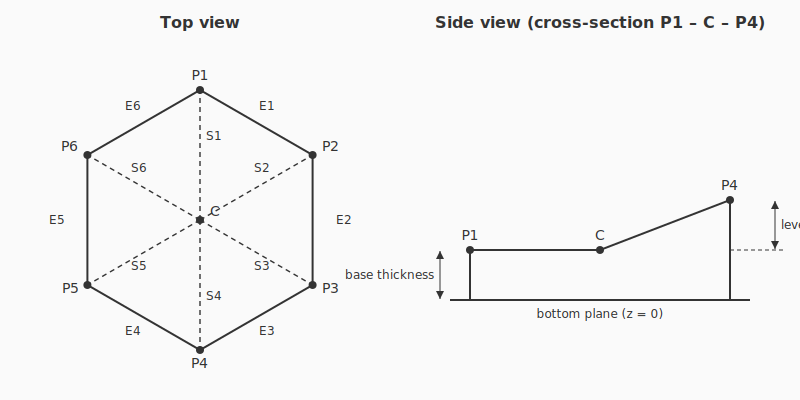

# HexFinity

A Blender 5.1 add-on for generating modular hexagonal terrain tiles for tabletop miniatures and dioramas.

HexFinity creates a single hexagonal tile per click. Each of the six corners has an independently controllable height level, the top surface is subdivided enough to support smooth transitions across the whole tile, and the resulting mesh is watertight (2-manifold) so it is ready for 3D printing, sculpting, or further modifier stacks.

All linear inputs are expressed in **millimeters**. The add-on converts to Blender's internal meters at mesh-build time so the user does not have to change scene units.

---

## Geometry

### Anatomy



*Top view* labels the six corners `P1`–`P6`, the six rim edges `E1`–`E6` (each `Ei` is the edge `Pi → Pi+1`, wrapping `P6 → P1` as `E6`), the centre vertex `C`, and the six spokes `S1`–`S6` (each `Si` is `C → Pi`). *Side view* is a cross-section through the `P1–C–P4` axis with corner `P4` raised one level above the rest, showing how `base thickness` and `level height` stack along Z.

### Hexagon shape

- Regular hexagon, **point-up** orientation, lying in the XY plane.
- **Diameter** is the absolute point-to-point distance (long diagonal) in mm. The circumradius is `R = diameter / 2`.
- Corners are labeled **P1 – P6 clockwise** viewed from above (+Z):
  - **P1** is at the top (12 o'clock).
  - P2 is 60° clockwise from P1, P3 is at the 4 o'clock position, etc.

### Center vertex

A single vertex `C` sits at the geometric centroid (X = 0, Y = 0). Its Z is the **average of the six corner Zs** by default. An optional **center level override** lets the user pin the center to an explicit level (handy for domes, bowls, or plateaus).

### Height / level system

- Each corner carries a **non-negative integer level** (0, 1, 2, …). Inputs below 0 are clamped to 0.
- The **level height** parameter (mm) is the vertical distance for one level step.
- The Z of a corner is `baseThickness + level × levelHeight`. This keeps the side walls non-degenerate even when every corner is at level 0.

### Top surface

The top is built from **six bicubic Hermite Coons patches**, one per `(C, Pi, Pi+1)` region. Each patch has its `u=0` parametric edge collapsed to the apex `C`, the `u=1` edge as the straight rim from `Pi` to `Pi+1`, and the `v=0` / `v=1` edges as the straight spokes from `C` to `Pi` and `C` to `Pi+1`. Cross-boundary tangents at the rim and across each spoke are horizontal vectors (`Tu1 = β·n_rim`, `Tv0 = γ·n_spoke`), with apex radial tangents `Tu0 = α·(P − C)_xy` linearly blended in `v`. Default magnitudes are `α = 1`, `β = γ = apothem`.

The construction guarantees:

- **G0 continuity at every internal spoke and along the rim.** Spoke and rim curves are straight lines shared by definition between adjacent patches and tiles.
- **C∞ smoothness inside each patch.** The Coons evaluation `S = F_u + F_v − B` is an analytic function of `(u, v)`, so the interior of each patch has no creases.
- **Vertex deduplication at every shared key** (`center`, `corner`, `spoke`, `rim`), so the mesh stays manifold across patch boundaries.

What the construction does **not** deliver — and why:

- **Not strict G1 across spokes.** The actual `∂S/∂v` at a spoke depends on the patch's own rim curve `c1`. Each adjacent patch sees a different rim, so the cross-spoke derivatives don't match at the spoke (the visible result is a faint slope change at the spoke under sharp directional lighting, hidden under Blender's shade-smooth for most settings).
- **Tile-to-tile rim seams are G0, not G1.** The cross-rim derivative `∂S/∂u(1, v)` reduces to `H0(v)·(Pi − C) + H1(v)·(Pip1 − C)`, which uses each tile's own center `C`. Two tiles sharing a rim have different centers, so the cross-rim tangent planes don't match exactly across the seam. Shade-smooth still produces a visually acceptable join.

For tiles with all corner levels equal (flat-top tiles), the surface degenerates to a flat horizontal disk at `z = base_thickness`, exactly. The unit tests verify this and the other invariants.

The `subdivisions` parameter is the number of cells per patch direction (so the parametric grid is `(subdivisions+1) × (subdivisions+1)` per patch). Top face count per tile is `6·(subdivisions+1)²` — a mix of `6·(subdivisions+1)` apex-fan triangles and the rest as quads wound for `+Z` normal.

### Base, sides, bottom (manifold guarantee)

- The **bottom is a flat hexagon at Z = 0** for every tile, regardless of corner levels. Tiles always sit flush on a flat board and on each other.
- **Base thickness** (mm) is the minimum gap between the bottom plane and the top surface.
- Side walls are quads connecting each top-edge boundary loop to the matching bottom-edge loop, subdivided the same way along each hexagon side so the vertex counts agree.
- The bottom face is a flat hexagonal cap.
- The mesh is **closed and 2-manifold**: every edge is shared by exactly two faces — verified programmatically after generation. A failure aborts loudly instead of silently producing a broken tile.

---

## UI

The plugin adds a **HexFinity** tab to the 3D Viewport's N-panel (sidebar):

```
HexFinity
├─ Base
│   ├─ Diameter point-to-point (mm)
│   ├─ Level height (mm)
│   └─ Base thickness (mm)
├─ Corner levels (clockwise from top)
│   ├─ P1  [ int ≥ 0 ]
│   ├─ P2  [ int ≥ 0 ]
│   ├─ P3  [ int ≥ 0 ]
│   ├─ P4  [ int ≥ 0 ]
│   ├─ P5  [ int ≥ 0 ]
│   └─ P6  [ int ≥ 0 ]
├─ Center
│   ├─ Override center level (toggle)
│   └─ Center level (int, enabled when override is on)
├─ Top surface
│   └─ Subdivisions per triangle edge (int ≥ 0)
└─ [ Generate Tile ]
```

Each *Generate Tile* click creates a new tile in the active collection. The previously generated tile is left untouched.

---

## Project layout

```
C:\Work\Hexfinity\
├─ README.md                  (this file)
├─ hexfinity\
│   ├─ __init__.py             # register / unregister (lazy bpy import)
│   ├─ blender_manifest.toml   # extension metadata (replaces bl_info)
│   ├─ properties.py           # HexFinityProperties (PropertyGroup)
│   ├─ operators.py            # HEXFINITY_OT_generate operator
│   ├─ panel.py                # HEXFINITY_PT_panel (sidebar UI)
│   ├─ mesh_builder.py         # pure-Python mesh construction (no bpy)
│   └─ manifold_check.py       # post-build 2-manifold verification
└─ tests\
    ├─ conftest.py
    ├─ test_mesh_builder.py
    └─ test_manifold_check.py
```

`mesh_builder.py` deliberately contains no `bpy` imports so it can be unit-tested outside Blender (`__init__.py` defers its bpy imports into `register()` for the same reason).

HexFinity is packaged as a **Blender extension** (see `blender_manifest.toml`), the format Blender 5.x ships with — there is no `bl_info` dict in `__init__.py`.

---

## Install (development)

The repo ships a `deploy.ps1` helper at the root:

```
.\deploy.ps1            # rebuild dist\hexfinity-<version>.zip
.\deploy.ps1 -Dev       # also junction the source folder into user_default for live editing
.\deploy.ps1 -Dev -BlenderVersion 5.2   # target a different Blender version
```

After running with `-Dev`, in Blender: *Edit → Preferences → Get Extensions*, click the refresh icon, find **HexFinity** under the *user_default* repository, and enable it. In the 3D Viewport press `N`, open the **HexFinity** tab.

For end-user install, run `.\deploy.ps1` and use *Preferences → Get Extensions → drop-down menu → Install from Disk…* on the produced zip.

The script reads the version from `blender_manifest.toml`, strips `__pycache__`, and writes the zip with the manifest at root (the layout Blender expects).

### Running the unit tests

`mesh_builder.py` and `manifold_check.py` are unit-tested with `pytest`. You can run them against Blender's bundled Python (which contains no `bpy` dependency for these modules):

```
"C:\Program Files\Blender Foundation\Blender 5.1\5.1\python\bin\python.exe" -m pip install --user pytest
"C:\Program Files\Blender Foundation\Blender 5.1\5.1\python\bin\python.exe" -m pytest tests -v
```

---

## Verification

After generating a tile:

1. **Visual smoke test** — diameter = 100 mm, level height = 5 mm, levels `0,1,2,1,0,0`, subdivisions = 4, base thickness = 3 mm. Expect a six-sided tile with a ramped top.
2. **Manifold check** — Edit Mode → *Select → All by Trait → Non-Manifold*. Zero vertices selected = pass. (The plugin's own check already asserts this.)
3. **Tessellation check** — duplicate the tile and offset by one hex pitch in X / Y. Opposing edges should align with no gaps.
4. **Smoothness check** — shade-smooth the top faces (the per-patch interior is already C∞; shading just averages the patch-to-patch normals across the spokes). A Subdivision Surface modifier is not required for smoothness *within* a tile.
