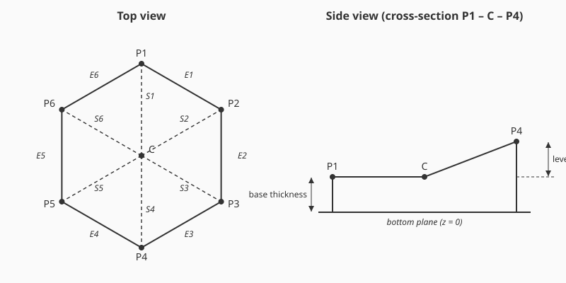
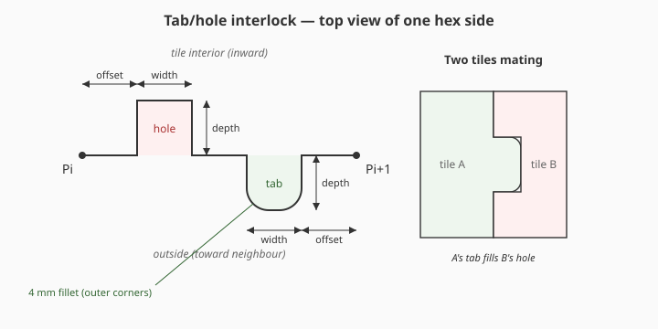
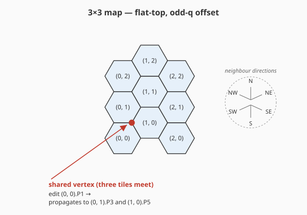
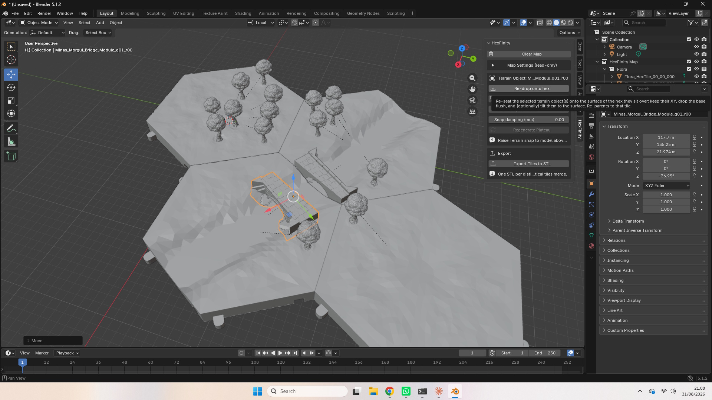
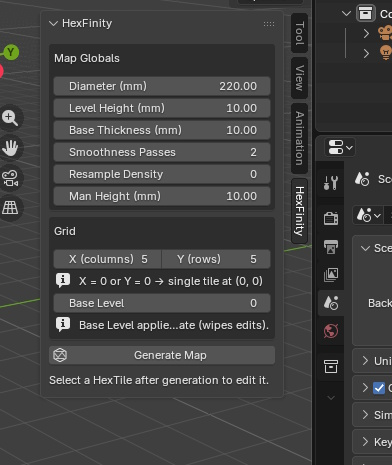

# HexFinity

A Blender 5.1 add-on for generating modular hexagonal terrain maps for tabletop miniatures and dioramas.

HexFinity generates an **X×Y map** of flat-top hexagonal tiles in one click. Each tile keeps an independently controllable level for each of its six corners, and corners that geometrically meet on the seam between tiles stay locked together so the map's surface is continuous across every join. The top surface of each tile is subdivided enough to support smooth transitions across the whole tile, and the resulting mesh of each tile is watertight (2-manifold) so it is ready for 3D printing, sculpting, or further modifier stacks.

All linear inputs are expressed in **millimeters**, and mesh vertices are emitted in millimeters too. Blender's STL exporter writes raw vertex values, so the exported `.stl` opens at true mm scale in any CAD program or slicer. In Blender's own viewport the tile appears at the numeric value — a 100 mm tile is 100 *units* wide — because Blender's default scene unit is metres; optionally switch the scene to *Metric · Millimeters* (`scale = 0.001`) for a friendlier on-screen display.

## Contents

- [Geometry](#geometry)
  - [Anatomy](#anatomy)
  - [Hexagon shape](#hexagon-shape)
  - [Center vertex (dome shaping)](#center-vertex-dome-shaping)
  - [Height / level system](#height--level-system)
  - [Top surface](#top-surface)
  - [Base, sides, bottom (manifold guarantee)](#base-sides-bottom-manifold-guarantee)
  - [Tile interlocks (male/female tabs)](#tile-interlocks-malefemale-tabs)
- [Terrain (X×Y map) generation](#terrain-xy-map-generation)
  - [Map invariants](#map-invariants-uniform-across-every-tile)
  - [X / Y semantics](#x--y-semantics)
  - [Layout (odd-q offset, flat-top)](#layout-odd-q-offset-flat-top)
  - [Shared corners](#shared-corners-editing-one-corner-edits-up-to-two-others)
  - [Clear](#clear)
- [Terrain brush (sculpt)](#terrain-brush-sculpt)
- [Terrain objects (import & snap)](#terrain-objects-import--snap)
- [Flora](#flora)
- [Procedural surface textures](#procedural-surface-textures)
- [Export STLs](#export-stls)
- [Slice to G-code (Bambu Studio)](#slice-to-g-code-bambu-studio)
- [UI](#ui)
- [Project layout](#project-layout)
- [Install (development)](#install-development)
  - [Running the unit tests](#running-the-unit-tests)
- [Verification](#verification)

---

## Geometry

### Anatomy



*Top view* labels the six corners `P1`–`P6`, the six rim edges `E1`–`E6` (each `Ei` is the edge `Pi → Pi+1`, wrapping `P6 → P1` as `E6`), the centre vertex `C`, and the six spokes `S1`–`S6` (each `Si` is `C → Pi`). *Side view* is a cross-section through the `P5–C–P2` axis (left-right diagonal) with corner `P2` raised one level above the rest, showing how `base thickness` and `level height` stack along Z.

### Hexagon shape

- Regular hexagon, **flat-top** orientation, lying in the XY plane.
- **Diameter** is the absolute point-to-point distance (long diagonal — corner-to-opposite-corner) in mm. The circumradius is `R = diameter / 2`. The apothem (short half-width, edge midpoint to centre) is `a = R · √3 / 2`.
- Corners are labeled **P1 – P6 clockwise** viewed from above (+Z):
  - **P1** is at the upper-right (1 o'clock).
  - P2 is at the right (3 o'clock), P3 at the lower-right (5 o'clock), P4 lower-left (7 o'clock), P5 left (9 o'clock), P6 upper-left (11 o'clock).
- Diameter is a **map-wide invariant**: every tile in the map shares the same point-to-point diameter so the tiles tessellate cleanly. See *Terrain (X×Y map) generation* below.

### Center vertex (dome shaping)

A single vertex `C` sits at the geometric centroid of each tile by default (tile-local X = 0, Y = 0). Its Z is the **average of the six corner Zs** by default, so it is **recalculated on every rebuild** — whenever the corners change (including a multi-select bulk edit) the centre follows them. An optional **center level override** lets the user pin the centre to an explicit level (handy for domes, bowls, or plateaus); a pinned centre **ignores** corner changes and stays put. The centre XY can also be dragged inside the hex via the on-screen gizmo; it is clamped to a 1 mm safety buffer inside the rim.

Two per-tile knobs shape the bump that grows out of a raised centre (the inner `Q1..Q6` control ring between `C` and the rim drives it):

- **Dome Area** (0.1–0.9) — radial position of the inner ring. Low = a narrow, tight dome; high = a broad dome reaching toward the rim.
- **Dome Damping** (0–1) — how far the inner ring is pulled from the centre toward the corner-edge midpoint. `0` = flat-topped plateau, `1` = sharp peak with a flat skirt; the default `2/3` is the smooth dome.

Both support right-click → *Copy to Selected* to apply across many tiles at once.

**Local Subdivision** is a per-tile integer that adds extra linear-midpoint mesh density to just that tile on top of the map-wide *Resample Density* — useful when one tile needs a fine procedural surface or sharp brush detail. Each pass quadruples the tile's top faces (`4ⁿ`), so a value of 2–3 is plenty for cobblestone and ~4 for cracks; changing it clears any painted brush detail and forces a terrain-object plateau on that tile to recompute.

### Height / level system

- Each corner carries a **non-negative integer level** (0, 1, 2, …). Inputs below 0 are clamped to 0.
- The **level height** parameter (mm) is the vertical distance for one level step.
- The Z of a corner is `baseThickness + level × levelHeight`. This keeps the side walls non-degenerate even when every corner is at level 0.

### Top surface

The top is built by **Loop subdivision** of a fixed 13-vertex control mesh — the centre `C`, the six rim corners `P1..P6`, and six auto-derived inner-ring vertices `Q1..Q6` (see *Center vertex* above). The six rim edges are tagged **sharp** so they stay perfectly straight under subdivision — mandatory for the side wall to attach and for neighbouring tiles to meet without gaps. Loop's stencils naturally damp a centre displacement into a smooth radial bump, with none of the per-spoke creasing the previous Coons-patch construction had (the math lives in `subdivision.py` / `mesh_builder.py`).

For tiles with all corner levels equal, the surface degenerates to a flat horizontal disk at `z = base_thickness`, exactly. The unit tests verify this and the other invariants.

Top-surface resolution is driven by two map-wide parameters:

- **Smoothness Passes** — Loop subdivision iterations (shape detail *and* smoothness). 2 passes ≈ 288 tris/tile, 3 ≈ 1152, 4 ≈ 4608; bump until the dome looks right.
- **Resample Density** — extra linear-midpoint subdivision applied *after* Loop smoothing. It only adds polygons (chord midpoints) without introducing new smoothing, giving downstream displacement (brush, procedural surfaces) more vertices to work with. The per-tile *Local Subdivision* stacks on top of this.

The top-vertex count depends only on the total pass count, never on the corner heights — which is what lets the brush store a stable `float[num_top]` displacement layer (see `top_vertex_count`). A terrain-object plateau, by contrast, adds its own extra local vertices each rebuild via adaptive refinement rather than reusing a fixed-size layer — see *Terrain objects* below.

### Base, sides, bottom (manifold guarantee)

- The **bottom is a flat hexagon at Z = 0** for every tile, regardless of corner levels. Tiles always sit flush on a flat board and on each other.
- **Base thickness** (mm) is the minimum gap between the bottom plane and the top surface.
- Each side wall is built as a **single n-gon** that walks the top rim left→right and the bottom rim right→left, detouring up and over the tab and down into the hole cavity so the wall stays watertight around both openings.
- The bottom is a **triangle fan from the tile centre** with two ear triangles per side that bypass the hole cavity footprint (a plain centre-fan would cross the cavity interior, which is no longer star-shaped from the centre after the holes are cut).
- The mesh is **closed and 2-manifold**: every edge is shared by exactly two faces — verified programmatically after generation. A failure aborts loudly instead of silently producing a broken tile.

### Tile interlocks (male/female tabs)

Every hex side carries one rectangular **tab** sticking radially outward and one matching **hole** cut into the wall, placed mirror-symmetrically across the side midpoint so two neighbouring tiles click together — tab on one half lands in the hole on the other.



Tab and hole dimensions are module-level constants in `mesh_builder.py` and are not user-editable:

| Constant | Value (mm) | Meaning |
|---|---|---|
| `TAB_WIDTH_MM` | 10 | along the side |
| `TAB_HEIGHT_MM` | 8 | vertical (Z) |
| `TAB_DEPTH_MM` | 10 | radially outward |
| `TAB_OFFSET_FROM_CORNER_MM` | 10 | tab/hole inset from a corner |
| `TAB_HOLE_TOLERANCE_MM` | 0.5 | slack so tiles slide together |
| `TAB_FILLET_MM` | 4 | rounding on the tab's two outer vertical edges |
| `TAB_FILLET_SEGMENTS` | 3 | arc tessellation per rounded corner |

The tab's two **outer (leading) vertical edges** — the corners that enter the
hole first — are filleted with a `TAB_FILLET_MM` radius running the full tab
height, so neighbouring tiles align and seat more easily. The inner edge (the
wall junction) and both inner corners stay square, and the flat outer face keeps
a width of `TAB_WIDTH_MM − 2·TAB_FILLET_MM` (2 mm at the defaults), so the joint
is still a solid fit. The tab is built as a vertical extrusion of this
rounded-rectangle profile; the square hole is left sharp (the smaller filleted
tab simply fits the existing tolerance). The rounding removes material only, so
the tab never extends past `TAB_DEPTH_MM`.

The interlock imposes two input constraints that `build_hex_tile` enforces with `ValueError`:

- **`base_thickness_mm ≥ 8.5 mm`** (`TAB_HEIGHT_MM + TAB_HOLE_TOLERANCE_MM`) — the base has to be thick enough to host the hole.
- **`diameter_mm` large enough** that a side leaves at least 0.1 mm of solid material between hole and tab. The side length is `diameter_mm / 2`, so the constraint is `diameter_mm / 2 − 2·offset − 2·width − tolerance / 2 ≥ 0.1 mm`. With the defaults above that is **`diameter_mm ≥ 80.7 mm`**.

---

## Terrain (X×Y map) generation

HexFinity always generates a **map** of one or more tiles, not a loose pile of independent hexes. The map is owned by the active scene (one map per scene by design) and lives under a dedicated `HexFinity Map` collection that the generator creates for you.

### Map invariants (uniform across every tile)

These four parameters live on the **scene-level** property group because changing them on one tile but not another would either tear the tessellation open or break the side-wall vertex counts at the seam:

| Parameter | Why it must be uniform |
|---|---|
| **Diameter** (mm) | Drives the grid pitch — every tile in the map must have the same point-to-point diameter to close cleanly. |
| **Level height** (mm) | A shared corner is shared at the *level* — different `level_height` values on the two sides would put the corner at two different Zs. |
| **Base thickness** (mm) | Every tile sits flush on z = 0 with its top surface at `base_thickness + level × level_height`; differing base thickness would step the top across the seam. (UI minimum 10 mm so the tab/hole interlock fits inside the base.) |
| **Smoothness Passes** + **Resample Density** | Both set the per-tile top-surface topology (see *Top surface*). Side walls only stay manifold if both sides of a seam share the same rim vertex count, so these are map-wide. |

A fifth global, **Man Height (mm)**, is the model-scale reference (a printed human figure, 28 mm ≈ common wargaming scale). Procedural-surface feature sizes default to their real-world size scaled by it. These globals are edited on the **Map Globals** panel. Changes propagate live to every tile in the map — diameter changes also re-position every tile because the grid pitch depends on it.

### X / Y semantics

The grid extent is two integers `X` and `Y`:

- `X = number of columns` (q-coordinate ranges over `[0, X-1]`).
- `Y = number of rows` (r-coordinate ranges over `[0, Y-1]`).
- If either is `0`, HexFinity generates a **single tile** at (q=0, r=0) — the original one-tile workflow is preserved.

`X` and `Y` only take effect on the next **Generate** (see [Clear](#clear) below); the live update callbacks fire only for the map-wide invariants. To change them once a map exists, press *Clear*, edit the integers, then *Generate* again.

### Layout (odd-q offset, flat-top)



Columns run vertically; **odd columns are shifted up by half a row**. With `R = diameter / 2`, `col_pitch = 1.5 · R`, and `row_pitch = √3 · R`, the world-space position of tile `(q, r)` is:

```
x = q · col_pitch
y = r · row_pitch  + (q is odd ? row_pitch / 2 : 0)
```

Each tile is generated centred at its own object origin and then placed in the scene at that world-space position. The mesh-build code is unchanged from the single-tile path.

### Shared corners ("editing one corner edits up to two others")

Every interior vertex of the tessellation is geometrically the same point as one corner on each of **three** tiles. HexFinity treats that as an **editing-time alignment relationship**: when you change a corner level on one tile, the matching corner level on the (up to two) neighbour tiles that share that vertex is set to the same value immediately, so the rim height matches across the seam.

What "shared" does *not* mean:

- The mesh vertices stay **separate per tile** — each tile is its own watertight 2-manifold mesh, with its own six rim corners. Vertex deduplication only happens *within* a single tile's mesh.
- What is shared is the **level value**, and through it the resulting Z. Propagation is one direction (`p_i` write → matching `p_j` writes on neighbours) — there is no cycle because the re-entrancy guard short-circuits the recursive callback.

Edge-of-map corners propagate silently: a missing neighbour just means there is nothing on the other side, which is correct behaviour for the map boundary.

The centre vertex of each tile (XY offset, override-level, override-toggle) is **purely tile-local** — centres do not propagate, because they never reach a seam.

### Multi-tile parallel corner editing

When **more than one** HexFinity tile is selected, changing a corner slider on the active tile applies the **same delta** to that *same corner index* on every selected tile. Raising the active tile's `P1` by +2 raises every selected tile's `P1` by +2 (each tile clamps independently at level 0, so a downward delta can bottom some tiles out while others keep dropping). This makes it quick to lift or lower a whole region by a uniform amount while still letting individual tiles differ.

Only the six corner levels `P1`–`P6` fan out this way — centre level, dome, and XY remain per-tile (active object only). The Corner Levels panel shows an `N tiles selected — edits apply to all` hint while a multi-selection is active. Because the parallel edit touches the same *labelled* corner on each tile and seam sync then re-asserts equality on the *geometrically shared* corner (a different index), an adjacent multi-selection converges to a tear-free region lift.

### Clear

Once a map exists, the global parameters auto-collapse into a single read-only **Map Settings** header (expand it to view the values the map was generated with — every field is disabled) and the only action button is **Clear Map**. This keeps the panel compact and stops generate-time settings from being edited mid-map.

**Clear Map** opens Blender's built-in confirmation dialog (a Yes/No prompt), then destructively deletes the entire `HexFinity Map` collection — every tile, imported terrain object, scattered boulder and procedural surface (all linked into that collection). It does **not** rebuild anything: `is_generated` flips back to `False`, so the panel returns to **Branch A**, where the globals and grid become editable again and the **Generate** button reappears. Use Clear to change `X` / `Y` or any global (which the live-update callbacks otherwise ignore), or to start over completely. **All edits are lost.**

---

## Terrain brush (sculpt)

A modal **Terrain Brush** lets you raise or lower the top surface freehand, sculpt-style. Press *Paint*, then left-drag across the tiles; right-click or `Esc` exits. The on-screen ring shows the brush size (blue = raise, orange = lower).

- **Radius / Strength** — brush size (mm) and millimetres of displacement per second of dragging at the centre, with a smooth falloff to the rim.
- **Raise / Lower** — stroke direction.
- **Preserve Edge** — damps the brush to ~0 within an **Edge Falloff** band of the hex rim so straight edges and shared corners stay put. Turn it off to let a stroke flow across a seam onto the neighbouring tile.

The result is stored as data, not baked geometry: a per-top-vertex z-offset layer (`hf_brush_disp`) that the builder re-applies (clamped to the base thickness) on every rebuild. So painted detail survives corner-height edits — but changing *Smoothness Passes*, *Resample Density*, or *Local Subdivision* changes the vertex count and therefore clears the paint.

## Terrain objects (import & snap)

The **Terrain Objects** button imports an `.stl` mesh, centres it over the selected tile, drops its base flush onto the top surface, and parents it to the tile so it travels with it. Imported objects live in the map collection beside the hex and are merged into that tile's STL on export.

Selecting a dropped (non-tile) object shows a small panel to **Re-drop onto hex** — re-seat it onto the surface of whichever hex it currently sits over — plus two sliders that reshape the hex *under* the model:

- **Terrain snap to model** — above 0 enables a genuine flat **plateau** under the model's flat base: the same local-refinement mechanism Flora uses under a planted tree (see below), reused for terrain objects. It locally densifies and exactly flattens the mesh, to the base's height plus a 0.2 mm overlap, wherever an up-raycast finds a flat area (arch openings and overhangs are left alone) — so a small or detailed model doesn't end up seated on just one or two lumpy vertices even on a coarsely-subdivided tile. This is the *only* mechanism that deforms the hex to match a terrain object; the slider's exact value above 0 doesn't otherwise change the result, only whether the plateau is on.
- **Snap damping** (mm) — blend the plateau into the surrounding terrain over this width for an organic skirt instead of a hard cliff at the footprint edge (faded near the rim so seams stay aligned).

Because a model's footprint is rarely circular like a tree's base cut, it's tiled into several small pads rather than one big one, so an irregular or concave base (e.g. one with a hole) doesn't get over-flattened outside its true silhouette.

The plateau is recomputed and cached automatically whenever the model's snap sliders change, but the cache can't see an in-place mesh edit (e.g. re-exporting the same `.stl` with different geometry at the same transform) or a move that doesn't also touch a slider. A **Regenerate Plateau** button lives in the **Terrain Objects** section for that case — on the terrain-object panel (greyed out until *Terrain snap to model* > 0) and on the tile panel's **Terrain Objects** box, alongside **Import STL** — it forces a fresh pass regardless of the cache, for every terrain object on the selected hex, and reports how many plateau pads it found (0 means the model's base isn't flat enough anywhere for the feature to activate).

### Splitting an oversized terrain object across hexes

A terrain object is only ever parented to (and eligible for a plateau on) the one hex it was dropped onto — the plateau/pad system never looks at neighbouring tiles, so a model that visually overhangs into them (the *"extends past the hex boundary"* warning from Import/Re-drop) never gets a plateau carved into those neighbours. The screenshot below shows exactly this case: a bridge module spans three hex tiles but is parented to only one of them (`Minas_Morgul_Bridge_Module_q01_r00`), so only that tile's plateau responds to its footprint.



**Split by Hex Boundaries**, on the dropped-object panel next to **Re-drop onto hex**, fixes this destructively: it boolean-cuts the object along the hex grid so each resulting piece is parented to (and plateau-eligible on) exactly one hex, carrying over the original's *Terrain snap to model*/*Snap damping* settings.

Clicking it shows a confirmation dialog with the exact number of pieces the cut will produce before anything happens; confirming deletes the original object, replaces it with one new terrain object per hex it actually overlapped, and immediately regenerates the plateau on every affected hex. Any part of the model that falls outside every hex tile is discarded — it's simply never included in any piece, not kept as an orphaned leftover. If the object already fits within a single hex, the button reports that there's nothing to split and makes no change.

## Flora

The Flora box plants real tree meshes onto a tile. A **Tree Type** dropdown (currently just "Leafy tree") selects which asset folder to plant from; **Scale Variation** sets a +/- percentage jitter around 1.0 applied to each tree; **Flatten Base** (on by default) tessellates a small flat pad into the terrain under each tree's footprint, blended smoothly back into the surrounding surface over **Pad Blend (mm)**, so a tree's flat base cut sits flush and level even on sloped ground instead of poking through on the uphill side and floating on the downhill side; **Penetration** sets a small guaranteed sink (mm) into that pad so the base doesn't z-fight or make a zero-thickness contact. Pressing **Flora** starts a modal tool: move the mouse over any generated tile and a yellow circle-with-center-dot tracks the raycast hit point live; left-click plants a tree there — a species is chosen at random from the current Tree Type's asset folder, rotated a random amount around its vertical axis, and scaled by the random variation factor. Multiple trees can be planted in one activation. While it's running, the sidebar swaps the button for a "Flora active — Esc / RMB to close" indicator (it can't be a clickable Close button — a running modal operator owns all input, so panel buttons are unreachable until you exit); right-click or `Esc` closes it and restores the button.

Each species STL is imported from `assets/` once per Blender session and cached as a single shared mesh datablock; every planted tree is a separate Object pointing at that same shared mesh (a Blender "linked duplicate"), not a per-tree copy — the Outliner shows one mesh datablock with many object users. Planted trees live in a **Flora** sub-collection nested under the map's root collection, parented to their tile like scatter boulders and terrain objects. A tile's placements (species, position, rotation, scale) are stored as data and re-seated onto the surface on every rebuild — editing corner heights, painting terrain, or changing subdivision moves the trees with the ground instead of leaving them floating or buried. Clearing the map removes the Flora collection along with everything else.

**Avoid Overlap** (on by default) rejects a click that would plant a tree intersecting another one's bounding box, so every tree stays printable as a separate piece; **Min Spacing (mm)** requires extra clearance on top. Trees on the tile's 6 neighbours count too, so a tree near a seam can't overlap into the next tile's print. A rejected click warns and plants nothing.

### Pin/notch interlock

A planted tree and its tile can be printed as **two separate parts** and assembled by hand, the same idea as the tab/hole interlock between adjacent hex tiles: a small cylindrical pin stands off the true base of the tree, mating into a matching blind socket drilled into the tile under the tree's flatten pad. Sizes are hardcoded module constants in `mesh_builder.py`, independent of a tree's own random scale or the scene's Man Height print-scale slider:

| Constant | Value | Meaning |
|---|---|---|
| `FLORA_PIN_DIAMETER_MM` | 2.0 mm | Pin diameter — always exactly this |
| `FLORA_PIN_HOLE_TOLERANCE_MM` | 0.4 mm | Socket grows by this over the pin, mirroring `TAB_HOLE_TOLERANCE_MM` |
| `FLORA_NOTCH_DEPTH_MM` | 10.0 mm | Socket depth |
| `FLORA_PIN_LENGTH_MM` | 9.6 mm | Pin length — slightly shorter than the socket so it never bottoms out |

Cutting a real socket is too expensive to do on every interactive rebuild, so it's deferred: leaving the Flora tool (Esc/RMB) or pressing the **Finalize Flora** button cuts the socket and creates the pin for every planted tree; any other rebuild trigger (brush stroke, corner-height edit, terrain snap, or a flora pad-setting change) strips them again until Finalize Flora runs once more — the panel notes this next to the button.

The pin is **parented to its own tree** (not a loose sibling under the tile), counter-scaled so it stays exactly `FLORA_PIN_DIAMETER_MM` regardless of that tree's own random scale — it moves as one unit with the tree and shows up nested under it in the Outliner. Seating uses the exact pre-drill pad height rather than a raycast (which, once a socket exists, would otherwise hit the socket floor instead of the surrounding surface) — the tree and pin sit flush on top, with the pin and socket both hidden inside the print.

*Export Tiles to STL* then writes each finalized tree and its pin merged into **one** STL file (`hex_qNN_rNN_treeII.stl`), separate from the tile (which keeps the socket baked into its own mesh). The pair is flipped 180° as one rigid body before export so the canopy tip — not the pin's thin tip — sits on the print bed, with the pin (parented to the tree, so it's carried along by the same rotation) pointing up; a tile with unfinalized trees warns instead of exporting mismatched parts.

See **[docs/flora.md](docs/flora.md)** for the mesh caching, the overlap algorithm, the pin/notch cut algorithm, and the manual checklist.

## Bake

Every rebuild normally re-derives a tile's flora/terrain pads, flora pin/notch sockets, path-feature carving, any Draw Area region's own **Local Subdivision** geometry, and the terrain brush's painted offset from scratch. The **Bake** box (bottom of the tile panel, below Terrain Brush) freezes all of those into the mesh instead, so an unrelated edit — tuning a Surface Texture setting, say — replays the frozen result rather than recomputing it. **Bake Tile** also implicitly finalizes flora (see Pin/notch interlock above): pins/notches are cut as part of baking and, unlike an ordinary Finalize, stay in place across later rebuilds instead of being stripped again.

Displacement region *values* (Draw Area / Surface Texture) are explicitly **not** part of the bake — they're cheap and index-stable, so they keep applying live on top of the frozen layer either way, letting you keep iterating on texture work quickly once everything else is locked down. A region's own **Local Subdivision** *geometry* is the exception: it's a topology-changing operation in the same cost class as a flora/terrain pad, so it freezes with the rest.

A later edit that reshapes the tile's top surface (a corner height, dome settings, or a map-wide global) — or a changed flora placement, terrain object, path feature, or a Draw Area region with `local_subdiv > 0` — invalidates just the frozen pad/terrain/notch/path/region portion: the next rebuild silently reverts that portion to live recompute and prints a note in the console, rather than risking a mismatched or corrupt mesh. The frozen terrain-brush offset is unaffected by this — it only clears on a subdivision/resample change, the same rule the live brush layer already follows. **Un-bake Tile** clears everything and returns to fully live recompute; nothing about flora placements, terrain objects, or path features is ever deleted by baking, so it's fully reversible.

## Procedural surface textures

Procedural surfaces are applied through **regions**: closed loops you draw on the
tile (or a whole-tile region), each with its own surface type and parameters.
Multiple regions per tile are supported (e.g. a cobblestone road across a furrowed
field), each with an editable **Area Name**. Scale is driven by a map-wide
**Man Height (mm)** reference. Surfaces come in two *kinds*:

- **Displacement surfaces** — **cobblestone, gravel, plough & furrow, uncultivated
  plains, lake / still water, river / flowing water, creek / stream** — baked onto
  the tile top as real (printable) heightfield geometry. The look of cobbles/gravel
  comes from jittered Voronoi cells (a **Regularity** knob); river/creek reuse the
  same directional convention as plough & furrow, with a **Direction (deg)** field
  and a direction arrow overlay. Because the surface is a heightfield, detail is
  bounded by the top-vertex spacing — the panel warns when a feature is too fine
  for the current subdivision. Each region also has its own **Local
  Subdivision**, which locally densifies just that region's own polygon
  (+ **Edge Blend** band) instead of the tile-wide *Local Subdivision* —
  useful for one small area of fine cobblestone or gravel on an otherwise
  coarse tile. Like the tile-wide version, each pass locally quadruples
  triangles inside the region's footprint; unlike the always-live region
  *value*, this extra geometry is treated like a flora/terrain pad and is
  part of what [Bake](#bake) freezes.
- **Scatter surfaces** — **Boulder Field** — place *distinct objects* across the
  region **without changing the tile surface**. Boulders are noise-deformed
  icospheres, joined into one mesh `Boulders_<Area Name>` parented under the tile and
  seated on the real terrain by a downward raycast. Knobs: **Min/Max Boulder Size
  (mm)**, **Boulder Density**, **Size Distribution**. An optional **Merge** boolean-
  unions them into the tile so the whole tile prints as one manifold piece.

Both kinds share the same authoring UX (draw a region → pick a surface → tune
params) and ride the same registry: adding a surface is one record plus its
function(s), no UI/operator edits.

Regions can be authored two ways: **Draw Region** (click a point-by-point
polygon outline, Enter/RMB to close) or **Flood Fill** — a magic-wand-style
tool below it: hover the tile top and every connected face within an
**Angle Tolerance (deg)** of the hovered face's normal highlights live, click
to commit it as a region. Flood Fill is purely an authoring shortcut — under
the hood it grows a face selection by comparing normals (`face_select.py`,
bpy-free), then converts that selection's outer boundary into the exact same
tile-local-XY polygon a hand-drawn region would produce, so a flood-filled
region behaves identically to a drawn one afterwards (same masking, same
survives-subdivision guarantee). If the hovered patch wraps a hole or splits
into disconnected islands, committing it is refused with a warning instead of
silently picking one piece — lower the angle tolerance or click elsewhere.

See **[docs/procedural_surfaces.md](docs/procedural_surfaces.md)** for the
displacement workflow and **[docs/boulder-field.md](docs/boulder-field.md)** for the
scatter kind (algorithm, scene tree, merge-for-print, and manual checklist).

## Export STLs

The **Export Tiles to STL** button at the bottom of the panel writes one `.stl`
file per **distinct** hex tile into a folder you choose. Each file contains the hex
*and its terrain objects and scatter boulders* — merged into the same STL (STL is
just triangles, so no boolean union is performed). Each tile is centered at
the origin in its file so it drops straight onto a printer bed. Planted trees are
**not** included — each finalized tree exports as its own STL containing both
the tree and its pin (merged the same triangle-soup way, no boolean union),
flipped together as one rigid body so the pin prints pointing up rather
than on its own thin tip (see [Pin/notch interlock](#pinnotch-interlock));
a tile with unfinalized trees warns instead of exporting mismatched parts.

**Dedup & naming.** Identical tiles collapse to a single file, so you only slice each
distinct tile once:

- A tile's identity is a content hash of its **final built geometry** (hex mesh plus
  every terrain object, in tile-local space). This captures corner heights, dome
  shape, brush displacement, terrain-object plateaus, and procedural surface regions
  automatically.
- Plain tiles are named by coordinate — `hex_q00_r00.stl`.
- Tiles with any customization (terrain objects, terrain brush, a terrain-object
  plateau, or a drawn surface region) get a short content-hash suffix —
  `hex_q00_r00_<hash>.stl` — so two differing custom tiles never collide and
  byte-identical ones still share a file.

**Manifest.** Alongside the STLs the exporter writes `manifest.csv` and
`manifest.json` mapping every `(q, r)` coordinate to the file it uses, so you can
place printed tiles correctly even after duplicates were merged away. A second
`flora_manifest.csv`/`.json` maps each `(q, r, placement index)` to its
merged tree+pin `file` the same way. Unlike tiles, flora files are never
deduped — every placement gets its own uniquely-named file.

See **[docs/export.md](docs/export.md)** for the dedup contract and manifest format.

## Slice to G-code (Bambu Studio)

Once you have exported a folder of STLs, the standalone **`scripts/slice_tiles.py`**
batch-slices every tile to G-code with a locally installed **Bambu Studio**,
naming each output with its print quantity:

```
python scripts/slice_tiles.py [export_folder] [--settings path.json]
```

There is **no UI** — every parameter lives in `scripts/slice_tiles_settings.json`:
the export folder, **sparse infill density** (5–20%) and **pattern** (default
Honeycomb), plus **printer**, **nozzle**, **filament**, and **quality**. The
four preset keys may be left `""` to auto-pick the install's defaults (first
printer, 0.4 nozzle, the machine's default filament/process); naming a preset
that does not exist fails with the list of valid options. The file also carries
a `possible_values` reference block (ignored at slice time) listing every valid
value for each setting — regenerate it from the live install with
`python scripts/slice_tiles.py --refresh`. For each STL it writes a `.gcode.3mf`
(what Bambu printers ingest natively) *and* an extracted plain `.gcode`, both
named `hex_q00_r00.<count>.gcode[.3mf]` where `<count>` (read from
`manifest.json`) is how many copies of that tile the map needs.

No `bpy` is involved — the script runs in plain CPython. Its pure logic is
covered by `scripts/tests/test_slice_tiles.py`.

See **[docs/slicing.md](docs/slicing.md)** for parameters, the Bambu CLI
caveats this works around, and troubleshooting.

## UI

The plugin adds a **HexFinity** tab to the 3D Viewport's N-panel (sidebar). The panel has two branches.

### Generation menu

Before a map exists, the panel shows the **generation menu**: the editable **Map Globals** (diameter, level height, base thickness, smoothness, resample, man height) and **Grid** (X / Y / base level) settings, with a single **Generate Map** button at the bottom. Set everything here, then press *Generate*. Once a map exists these settings collapse to a read-only **Map Settings** header and the button becomes **Clear** (see [Clear](#clear)).



### Branch A — before any map exists

```
HexFinity
├─ Map Globals
│   ├─ Diameter (mm)
│   ├─ Level height (mm)
│   ├─ Base thickness (mm)
│   ├─ Smoothness Passes
│   ├─ Resample Density
│   └─ Man Height (mm)
├─ Grid
│   ├─ X (columns)   Y (rows)
│   ├─ ⓘ X = 0 or Y = 0 → single tile at (0, 0)
│   ├─ Base Level                (seeds every corner at this level on generate)
│   └─ ⓘ Base Level applies on (re)generate (wipes edits)
└─ [ Generate Map ]
```

### Branch B — once a map exists

Every per-tile section below (Editing, Terrain Objects, Flora, Surface Texture, Procedural Surface, Path Feature, Terrain Brush, Bake) is an independently collapsible panel — click its header to fold it away without affecting the others. Collapsing one is a per-session UI preference, not saved tile data. Editing starts expanded (▾, since Corner Levels/Center are the core editing controls); the rest start collapsed (▸) to keep the sidebar short.

```
HexFinity
├─ [ Clear Map ]                (invoke_confirm prompt; destructive delete)
├─ ▸ Map Settings (read-only)   (collapsed by default; expand to view, fields disabled)
│   ├─ Map Globals              (Diameter / Level / Base thickness / Smoothness / Resample / Man Height)
│   └─ Grid                     (X / Y / Base Level — only take effect on the next Generate)
│
├─ If active object is a HexFinity tile:
│  ├─ ▾ Editing: HexTile_qq_rr (q=qq, r=rr)
│  │   ├─ Corner Levels (clockwise from upper-right)
│  │   │   ├─ "N tiles selected — edits apply to all"  (only when >1 selected)
│  │   │   ├─ P1   [ int ≥ 0 ]   ← propagates to N.P3 + NE.P5
│  │   │   ├─ P2   ...           ← propagates to NE.P4 + SE.P6
│  │   │   ├─ P3                 ← propagates to SE.P5 + S.P1
│  │   │   ├─ P4                 ← propagates to S.P6  + SW.P2
│  │   │   ├─ P5                 ← propagates to SW.P1 + NW.P3
│  │   │   └─ P6                 ← propagates to NW.P2 + N.P4
│  │   └─ Center
│  │       ├─ Override center level (toggle)
│  │       ├─ Center level (int, enabled when override is on)
│  │       ├─ Center X / Center Y (mm)
│  │       ├─ Dome Area / Dome Damping        (bump shaping; Copy to Selected)
│  │       └─ Local Subdivision               (per-tile extra density)
│  ├─ ▸ Terrain Objects
│  │   ├─ [ Import STL ]       (drop on tile, parent)
│  │   └─ [ Regenerate Plateau ]  (shown only if the tile has terrain objects on it; force-recompute plateau for all of them)
│  ├─ ▸ Flora                  (Tree Type / Scale Variation / Flatten Base / Pad Blend / Penetration / Avoid Overlap / Min Spacing → Flora, Finalize Flora)
│  ├─ ▸ Surface Texture        (whole-tile base layer, no drawing needed — see below)
│  │   ├─ Surface type (incl. Uncultivated Plains) + Feature / Depth / Regularity / (Direction)
│  │   └─ [ Copy Settings ] [ Apply ]   (session clipboard; Apply fans out to the whole selection)
│  ├─ ▸ Procedural Surface     (region list + Draw Region / Flood Fill — see below)
│  │   ├─ [ Draw Region ]      (click a polygon outline, Enter/RMB closes)
│  │   ├─ [ Flood Fill ]       (hover to preview a connected same-angle patch, LMB commits)
│  │   ├─ Angle Tolerance (deg)  (Flood Fill's normal-angle threshold)
│  │   ├─ Area Name + Surface type
│  │   ├─ displace: Edge Blend / Local Subdivision (region-only, not tile-wide)
│  │   │            + Feature / Depth / Regularity / (Direction) + resolution warning
│  │   └─ scatter:  Min/Max Size / Density / Distribution + budget warning
│  │                + Merge into Tile / [ Merge Boulders into Tile ]
│  ├─ ▸ Path Feature            (line list + Edge Snap + Draw Feature — see below)
│  │   ├─ Edge Snap (int ≥ 2)   (snap points per hex edge, incl. both corners)
│  │   ├─ [ Draw Feature ]      (click waypoints above the tile; snapping to a
│  │   │                         hex-edge point or another line's waypoint ends it)
│  │   ├─ Name + Type (Simple / Gravel / Paved Road — each type carries its
│  │   │                         own texture, no separate Texture dropdown)
│  │   └─ Width / Depth / Repeat  (grayscale displacement texture
│  │                             sampled along the line — white raises, black
│  │                             carves; auto-carves into the tile on every
│  │                             edit, no manual step)
│  ├─ ▸ Terrain Brush          (Raise/Lower, Radius, Strength, Preserve Edge → Paint)
│  └─ ▸ Bake                   (freeze pads/notches/path carving/brush into the mesh)
│      ├─ [ Bake Tile ]         (shown when not yet baked)
│      └─ [ Un-bake Tile ]      (shown once baked; fully reversible)
│
├─ If active object is a dropped terrain object:
│  └─ Terrain Object: <name>
│      ├─ [ Re-drop onto hex ]
│      ├─ [ Split by Hex Boundaries ]  (destructive boolean cut; confirms piece
│      │                                count first — see Terrain objects above)
│      ├─ Terrain snap to model  (int, 0 = off; enables the plateau)
│      ├─ Snap damping (mm)
│      └─ [ Regenerate Plateau ]  (greyed out until Terrain snap to model > 0)
│
└─ Export                      (map-wide; always shown once a map exists)
    └─ [ Export Tiles to STL ] (directory dialog → one STL per distinct tile + manifest)
```

A floating sphere gizmo, hovering one *level height* above the tile's apex, drags the active tile's centre XY inside the hex. When a HexFinity tile is selected, the viewport also overlays `P1`–`P6` labels floating one *level height* above each corner so corner identity is unambiguous in the panel.

---

## Project layout

```
C:\Work\Hexfinity\
├─ README.md                  (this file)
├─ hexfinity\
│   ├─ __init__.py             # register / unregister (lazy bpy import)
│   ├─ blender_manifest.toml   # extension metadata (replaces bl_info)
│   ├─ properties.py           # HexFinityMapProperties + HexFinityProperties + surface regions + terrain features
│   ├─ operators.py            # generate_map / clear_map + cascade
│   ├─ panel.py                # HEXFINITY_PT_panel (sidebar UI, two-branch)
│   ├─ gizmo.py                # HEXFINITY_GGT_center (centre-XY drag gizmo)
│   ├─ overlay.py              # floating P1..P6 labels + region loops/direction + terrain feature lines
│   ├─ brush.py                # modal terrain paint brush
│   ├─ regions.py              # modal draw-region + flood-fill-region operators + region list UI
│   ├─ path_features.py        # modal draw-feature (waypoint line) operator + texture-carve pipeline + feature list UI
│   ├─ scatter.py              # bpy shell for scatter surfaces (boulder objects + merge)
│   ├─ flora.py                # modal click-to-plant tree tool + mesh cache + overlap check + pin objects
│   ├─ assets\
│   │   └─ leefytree\           # planted-tree STL assets (one file per species)
│   ├─ mesh_builder.py         # pure-Python mesh construction (no bpy)
│   ├─ tree_pads.py            # pure-Python tree-base-pad refine+flatten + pin/notch socket cut + path-feature curvilinear texture displacement (no bpy)
│   ├─ terrain_pads.py         # pure-Python footprint-grid → circular pad tiling (no bpy)
│   ├─ subdivision.py          # pure-Python Loop + linear-midpoint subdivision (no bpy)
│   ├─ procedural_surfaces.py  # pure-Python surface registry + masks + scatter geometry + obb_overlap (no bpy)
│   ├─ map.py                  # pure-Python grid math + SHARED_CORNERS table + edge snap points
│   ├─ tile_export.py          # pure-Python export hashing + naming (no bpy)
│   ├─ face_select.py          # pure-Python face-normal flood fill + boundary-loop extraction for the Flood Fill tool (no bpy)
│   └─ manifold_check.py       # post-build 2-manifold verification
└─ tests\
    ├─ conftest.py
    ├─ test_mesh_builder.py
    ├─ test_tree_pads.py
    ├─ test_terrain_pads.py
    ├─ test_subdivision.py
    ├─ test_procedural_surfaces.py
    ├─ test_face_select.py
    ├─ test_scatter.py
    ├─ test_map.py
    ├─ test_tile_export.py
    └─ test_manifold_check.py
```

`mesh_builder.py`, `tree_pads.py`, `terrain_pads.py`, `subdivision.py`, `procedural_surfaces.py`, `map.py`, `tile_export.py`, `face_select.py`, and `manifold_check.py` deliberately contain no `bpy` imports so they can be unit-tested outside Blender (`__init__.py` defers its bpy imports into `register()` for the same reason).

HexFinity is packaged as a **Blender extension** (see `blender_manifest.toml`), the format Blender 5.x ships with — there is no `bl_info` dict in `__init__.py`.

---

## Install (development)

The repo ships a `deploy.ps1` helper at the root:

```
.\deploy.ps1            # rebuild dist\hexfinity-<version>.zip
.\deploy.ps1 -Dev       # also junction the source folder into user_default for live editing
.\deploy.ps1 -Dev -BlenderVersion 5.2   # target a different Blender version
```

After running with `-Dev`, in Blender: *Edit → Preferences → Get Extensions*, click the refresh icon, find **HexFinity** under the *user_default* repository, and enable it. In the 3D Viewport press `N`, open the **HexFinity** tab.

For end-user install, run `.\deploy.ps1` and use *Preferences → Get Extensions → drop-down menu → Install from Disk…* on the produced zip.

The script reads the version from `blender_manifest.toml`, strips `__pycache__`, and writes the zip with the manifest at root (the layout Blender expects).

### Running the unit tests

The bpy-free modules (`mesh_builder.py`, `tree_pads.py`, `terrain_pads.py`, `subdivision.py`, `procedural_surfaces.py`, `map.py`, `tile_export.py`, `face_select.py`, `manifold_check.py`) are unit-tested with `pytest`. You can run them against Blender's bundled Python (which contains no `bpy` dependency for these modules):

```
"C:\Program Files\Blender Foundation\Blender 5.1\5.1\python\bin\python.exe" -m pip install --user pytest
"C:\Program Files\Blender Foundation\Blender 5.1\5.1\python\bin\python.exe" -m pytest tests -v
```

---

## Verification

After generating a map:

1. **Visual smoke test** — diameter = 100 mm, level height = 5 mm, base thickness = 10 mm, smoothness passes = 2, X = 3, Y = 3. Expect nine flat-top hex tiles tessellated in odd-q offset, all level 0 (flat).
2. **Manifold check (per tile)** — select any tile, Edit Mode → *Select → All by Trait → Non-Manifold*. Zero vertices selected = pass. (The plugin's own check already asserts this on build.)
3. **Tessellation check** — visually inspect the seams: opposing edges should align with no gaps and no overlap.
4. **Shared-corner check** — on tile `(0, 0)` set `P1 = 3`. Expect `(0, 1).P3` and `(1, 0).P5` to both jump to `3` and the top surface to stay continuous across the seam.
   - **Multi-select check** — select `(0, 0)`, `(1, 1)`, `(2, 0)` (active = `(0, 0)`); drag `P1` from 0 → 3 and all three tiles' `P1` read 3 with seams continuous. Drag `P1` 3 → 1 and all drop to 1. Pre-set one selected tile's `P1 = 1`, others higher, apply −2: the low one floors at 0 while the others drop by 2, no seam tears.
5. **Smoothness check** — shade-smooth the top faces (the per-patch interior is already C∞; shading just averages the patch-to-patch normals across the spokes). A Subdivision Surface modifier is not required for smoothness *within* a tile.
6. **Terrain brush check** — *Terrain Brush → Paint*, left-drag on a tile to raise a hill, then switch to *Lower* and dig. With *Preserve Edge* on the rim stays put; turn it off and a stroke flows across the seam onto the neighbour. Edit a corner level afterwards — the painted shape survives; bump *Smoothness Passes* and it clears.
7. **Terrain object check** — select a tile, *Terrain Objects*, pick an `.stl`; it drops centred and flush on the surface. Select the dropped object and raise *Terrain snap to model* above 0 — the ground under its footprint should immediately show visibly denser, flatter geometry than the rest of the tile (the plateau), flush with the model's base, rather than just a few displaced coarse vertices; add *Snap damping* for a blended skirt. An irregular or concave `.stl` base (e.g. one with a hole) should not have that hole flattened over. Click **Regenerate Plateau** (in the object's panel, or the tile's *Terrain Objects* box) — it should report the pad count found, re-run without error, and leave the plateau visually unchanged (nothing moved, so there's nothing new to recompute); it should be greyed out while *Terrain snap to model* is 0. If the object's underside isn't actually flat anywhere, the button (and the slider) should report/produce zero pads rather than silently doing nothing.
8. **Procedural surface check** — raise *Local Subdivision* on a tile, *Procedural Surface → Draw Region*, click a loop, close it (Enter). The interior gains cobblestone; the rim stays flat (still interlocks). Add a whole-tile *Furrow* region and rotate its **Direction** — the ridges follow the arrow. See [docs/procedural_surfaces.md](docs/procedural_surfaces.md). (A headless smoke test of the full register→region→rebuild path lives in `tests/_headless_region_check.py`: `blender --background --factory-startup --python tests/_headless_region_check.py`.)
9. **Flood Fill check** — raise one corner so the tile has a domed/sloped top, *Procedural Surface → Flood Fill*, hover near the flattest part: a translucent highlight should track the mouse, growing/shrinking as you raise/lower **Angle Tolerance (deg)**. Click to commit — a region appears in the list identical in behaviour to a hand-drawn one (assign it Cobblestone, confirm it displaces and fades to flat at its edge). Try hovering somewhere that would wrap a hole or split into two islands (e.g. a saddle shape with a generous tolerance) — clicking should refuse with a warning instead of committing a broken region. (A headless smoke test lives in `tests/_headless_flood_fill_check.py`: `blender --background --python tests/_headless_flood_fill_check.py`.)
10. **Surface Texture check** — select a tile, *Surface Texture*, set the type to **Uncultivated Plains**. The whole top gently rolls (no drawing/loop required) while the rim stays flat and interlocking. Draw a *Procedural Surface* Cobblestone region and a *Path Feature* line on top — both still carve/flatten correctly over the noisy base. Set the type back to *None* — the tile returns exactly to its prior flat/dome shape. Select two tiles (different `surface_type`s), make the first active, **Copy Settings**, select both with the first active, **Apply** — both tiles' Surface Texture settings become identical to the first's, and **Apply** is greyed out on a fresh session/.blend until something has been copied.
11. **Flora check** — select a tile, press *Flora*, then move the mouse across several tiles: a yellow circle-with-center-dot tracks the raycast hit point live. Left-click several spots — each plants a tree with a random species/rotation/scale, sunk in by *Penetration*. The Outliner shows the planted trees under a "Flora" sub-collection nested in the map collection, all pointing at a handful of shared mesh datablocks (multiple object users, not one mesh per tree). Orbit/pan/zoom (MMB/wheel) still work while it's active. Both `Esc` and right-click close it. Afterwards, edit that tile's corner heights or paint terrain — the trees re-seat onto the new surface instead of floating or burying. With *Avoid Overlap* on, clicking close enough to an existing tree is rejected with a warning instead of planting; turning it off allows it. See [docs/flora.md](docs/flora.md) for the full manual checklist.
12. **Tree base pad check** — raise a corner so the tile is sloped, then plant a tree near the raised side with *Flatten Base* on: the terrain under the tree tessellates into a small flat pad that blends smoothly back into the slope, and the tree sits flush and level instead of poking through on one side. Toggle *Flatten Base* off and the pad disappears (old sunken-in look returns); drag *Pad Blend (mm)* or *Penetration (mm)* and both re-seat live. Plant a tree near a hex edge and confirm the seam with the neighbour tile stays aligned (the pad fades out near the rim rather than desyncing it). A headless smoke test of the full plant→pad→rebuild→property-update path lives in `tests/_headless_flora_pad_check.py`: `blender --background --python tests/_headless_flora_pad_check.py`.
13. **Pin/notch check** — plant a tree and press `Esc`/right-click to leave the Flora tool: a socket is cut under the tree, the tree still sits flush on the surface (not sunk into the socket), and a `FloraPin_*` object appears **nested under its tree** in the Outliner. Paint a brush stroke elsewhere on the tile (or edit a corner height) — the pin disappears and the socket fills back in; press **Finalize Flora** and both return, tree still flush. Export the tile — a separate `flora_*.stl` is written alongside the tile's own STL, listed in `flora_manifest.csv`, with its lowest point (the pin's tip) sitting at z=0. Plant a tree, skip finalizing, and export — a warning appears and no `flora_*.stl` is written for it. A headless smoke test of the full plant→finalize→pin/socket→seating-correctness→un-finalize→re-finalize→export path lives in `tests/_headless_flora_pin_check.py`: `blender --background --python tests/_headless_flora_pin_check.py`.
14. **Bake check** — paint a brush stroke, plant a tree with *Flatten Base* on, drop a terrain object with snap enabled, and draw a Path Feature line, all on the same tile. Press **Bake Tile** — the mesh stays visually identical, the tree's pin/socket is cut (same as Finalize), and the *Terrain Brush* box's *Paint* strokes are folded in. Edit an unrelated Draw Area region afterwards — the pads/notches/path carving/brush stay put (not recomputed) and the region change still shows up. Paint another brush stroke — it stacks visibly on top of the frozen shape. Now edit a corner height: the console prints a revert notice, the pad/terrain/notch/path layer falls back to live and reflects the new corner shape, but the frozen brush contribution from before the edit is untouched. Press **Un-bake Tile** — everything returns to live recompute with no visible change, and the *Bake Tile* button reappears. A headless smoke test of the full brush+pad+pin+path bake→live-edit-untouched→corner-edit-invalidates→un-bake path lives in `tests/_headless_bake_check.py`: `blender --background --python tests/_headless_bake_check.py`.
